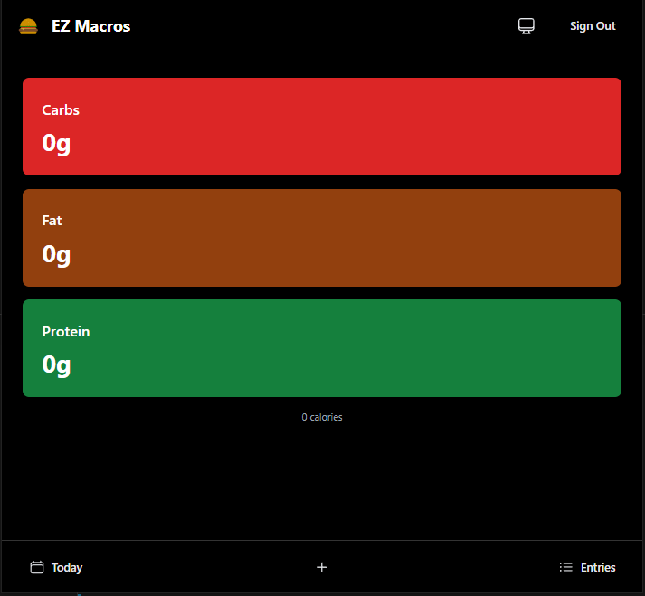
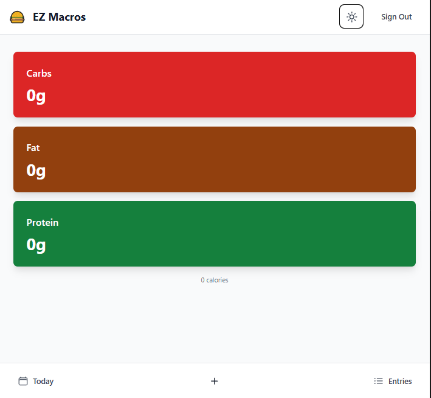

# EZ Macros Bruh

A modern, lightweight macro tracking app built with Preact and Supabase. Track your daily macronutrients with ease, scan barcodes for quick entry, and view your progress over time.




## Features

- 🌙 Beautiful dark/light theme with system sync
- 📱 Responsive design for all devices
- 📊 Daily macro tracking (carbs, fat, protein)
- 📷 Barcode scanning with Open Food Facts integration
- 📅 Flexible date range selection
- 📝 View and manage your entries
- 🔒 Secure authentication with Supabase
- ⚡ Lightning fast and lightweight

## Tech Stack

- [Preact](https://preactjs.com/) - Fast 3kB alternative to React
- [Vite](https://vitejs.dev/) - Next Generation Frontend Tooling
- [Supabase](https://supabase.com/) - Open source Firebase alternative
- [TailwindCSS](https://tailwindcss.com/) - Utility-first CSS framework
- [Headless UI](https://headlessui.dev/) - Unstyled UI components
- [date-fns](https://date-fns.org/) - Modern JavaScript date utility library
- [ZXing](https://github.com/zxing-js/library) - Barcode scanning library
- [TypeScript](https://www.typescriptlang.org/) - JavaScript with syntax for types

## Getting Started

### Prerequisites

- Node.js 18+ and npm
- A Supabase account (free tier works great)

### Installation

1. Clone the repository:
   ```bash
   git clone https://github.com/yourusername/ezmacrosbruh.git
   cd ezmacrosbruh
   ```

2. Install dependencies:
   ```bash
   npm install
   ```

3. Create a `.env` file in the root directory:
   ```env
   VITE_SUPABASE_URL=your_supabase_url
   VITE_SUPABASE_ANON_KEY=your_supabase_anon_key
   ```

4. Set up your Supabase database with the following SQL:
   ```sql
   create table macro_entries (
     id uuid default uuid_generate_v4() primary key,
     user_id uuid references auth.users not null,
     date date default current_date,
     carbs integer not null,
     fat integer not null,
     protein integer not null,
     created_at timestamp with time zone default timezone('utc'::text, now())
   );

   alter table macro_entries enable row level security;

   create policy "Users can only see their own entries" on macro_entries
     for all using (auth.uid() = user_id);
   ```

5. Start the development server:
   ```bash
   npm run dev
   ```

### Building for Production

```bash
npm run build
```

The built files will be in the `dist` directory.

## Features in Detail

### Authentication
- Email/password authentication
- Protected routes
- Persistent sessions

### Macro Tracking
- Add entries manually or via barcode
- View daily totals
- Delete entries
- Filter by date range

### Barcode Scanning
- Uses device camera
- Integrates with Open Food Facts database
- Automatic macro data population
- Fallback to manual entry

### Theme Support
- Automatic system theme detection
- Manual theme toggle
- Persistent theme preference

## Contributing

1. Fork the repository
2. Create your feature branch (`git checkout -b feature/AmazingFeature`)
3. Commit your changes (`git commit -m 'Add some AmazingFeature'`)
4. Push to the branch (`git push origin feature/AmazingFeature`)
5. Open a Pull Request

## License

This project is licensed under the MIT License - see the [LICENSE](LICENSE) file for details.

## Acknowledgments

- [Open Food Facts](https://world.openfoodfacts.org/) for their amazing API
- [Heroicons](https://heroicons.com/) for the beautiful icons
- The Preact team for the amazing framework
- The Supabase team for the awesome backend platform 